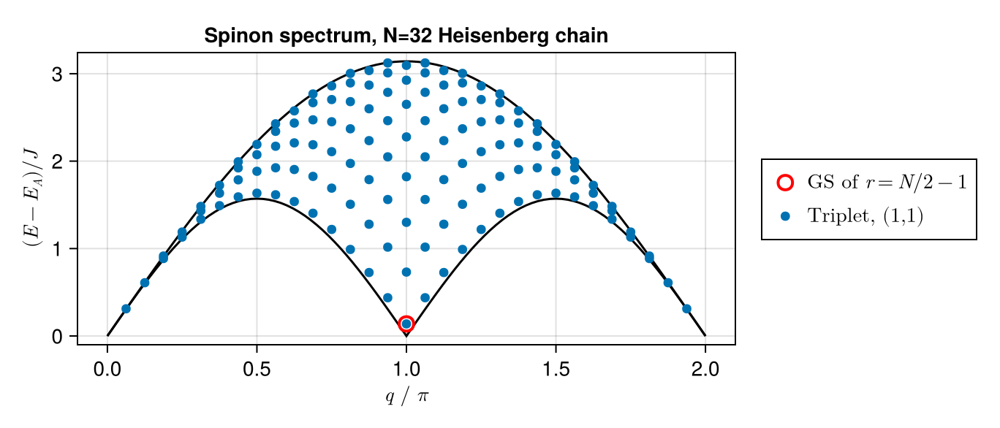

# Bethe-Ansatz
Personal repository for realization of Bethe Ansatz, epsecially on Heisenberg chain with given Hamiltonian
$$H = sJ\sum_{\langle i,j \rangle} \bold{S}_i\cdot \bold{S}_j$$
where $s = -1$ for ferromagnetic Heisenberg (FMH) model and $s=+1$ for antiferromagnetic one (AFMH).

The main reference of this work is [1][2].
## FMH chain
### Ground state
The ground state of FMH is quite easy, for the nearest neighor spin $\bold{S}_i$ being simply parallel, i.e.
$$\ket{F} = \ket{\uparrow \uparrow \cdots \uparrow \uparrow }\ \mathrm{or}\ \ket{\downarrow \downarrow \cdots \downarrow \downarrow }$$
where we have used the $U(1)$ symmetry by seting z-axis spin conserved (thus we can label it by $\uparrow$ or $\downarrow$). The two state is degenerate and we define $\ket{F} = \ket{\uparrow \uparrow \cdots \uparrow \uparrow }$ for simplicity

>Actually, each state with a $SU(2)$ rotation from $\ket{F}$ is a groundstate of Heisenberg model for its spin $SU(2)$ symmetry.
### Excitation spectrum
With given GS $\ket{F}$, the excitation spectrum can be obtained by several spin flip peration, i.e., adding several magnons.

Single magnon dispersion is 
$$E-E_F = J \cdot (1 - \cos k),\quad k=\frac{2\pi}{N}m,m=0,1,\cdots,N-1$$
2 magnons dispersion can be derived from
$$

$$
which can be claasified into 3 classes: 
- $C_1$ for $\lambda_1=0$: with dispersion exactly the single magnon one.
- $C_2$ for $\Delta \lambda \geq 2$: with continuous dispersion between $J(1\pm \cos k/2)$.
- $C_3$ for $\Delta \lambda \leq 1$: 2 magnon bound state with dispersion 
$$E-E_F = \frac{J}{2}(1-\cos k)$$

## AFM Heisenberg chain
### Ground state
The AFM groundstate can be derived from $\ket{F}$ with adding $r = N/2$ magnons. The resulting equation is 
$$

$$
### Excitation spectrum

### Magnetic response
A ferromegnetic-paramagnetic transition exists in AFMH in magnetic field, i.e.,
$$H = J\sum_{\langle i,j \rangle} \bold{S}_i\cdot \bold{S}_j - hS_T^z$$
with $h$ increasing, the average magnetization $m^z=S_T^z/N$ goes up til saturation value $m_s^z=1/2$.

## TODO
- Spinon singlet dispersion.
- Collective multi spinon excitation.

## Acknowledgments
The following packages has been used:
- [NLsolve.jl](https://github.com/JuliaNLSolvers/NLsolve.jl.git): for solving nonlinear equations.
