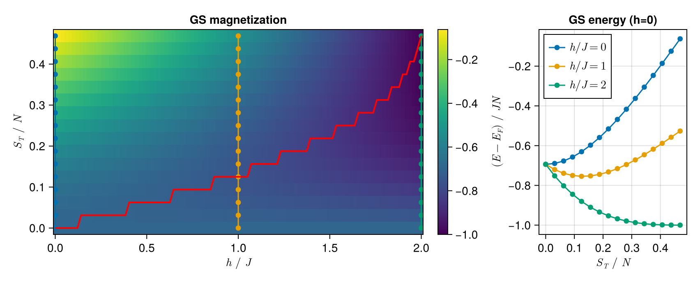

# Bethe-Ansatz
Personal repository for realization of Bethe Ansatz, epsecially on Heisenberg chain with given Hamiltonian

$$H = sJ\sum_{\langle i,j \rangle} \mathbf{S}_i\cdot \mathbf{S}_j$$

where $s = -1$ for ferromagnetic Heisenberg (FMH) model and $s=+1$ for antiferromagnetic one (AFMH).
## FMH chain
### Ground state
The ground state of FMH is quite easy, for the nearest neighor spin $\mathbf{S}_i$ being simply parallel, i.e.

$$\ket{F} = \ket{\uparrow \uparrow \cdots \uparrow \uparrow }\ \mathrm{or}\ \ket{\downarrow \downarrow \cdots \downarrow \downarrow }$$

where we have used the $U(1)$ symmetry by seting z-axis spin conserved (thus we can label it by $\uparrow$ or $\downarrow$). The two state is degenerate and we define $\ket{F} = \ket{\uparrow \uparrow \cdots \uparrow \uparrow }$ for simplicity, and its energy reads

$$E_F = \bra{F}H\ket{F} = \frac{JN}{4}$$
>Actually, each state with a $SU(2)$ rotation from $\ket{F}$ is a groundstate of Heisenberg model for its spin $SU(2)$ symmetry.
### Magnon Excitation
Given GS $\ket{F}$, the excitation spectrum can be obtained by several spin flip peration, i.e., adding several magnons.

1 magnon dispersion is 

$$E-E_F = J (1 - \cos k),\quad k=\frac{2\pi}{N}m,\quad m=0,1,\cdots,N-1$$

2 magnons dispersion can be derived from

$$2\cot \frac{\theta}{2}=\cot\frac{k_1}{2} - \cot\frac{k_2}{2},\quad Nk_l = 2\pi\lambda_l + (-1)^{l-1}\theta,\quad l = 1,2$$

where $0\leq \lambda_1\leq\lambda_2\leq N-1,\theta\in[0,2\pi]$. The solution can be claasified into 3 classes: 
- $C_1$ for $\lambda_1=0$ (real $k_l$): with dispersion exactly the single magnon one. 
- $C_2$ for $\Delta \lambda \geq 2$ (real $k_l$): with continuous dispersion between $J(1\pm \cos k/2)$.
- $C_3$ for $\Delta \lambda \leq 1$ (complex $k_l$): 2 magnon bound state with dispersion 

$$E-E_F = \frac{J}{2}(1-\cos k)$$

## AFMH chain
### Ground state
The AFM groundstate can be derived from $\ket{F}$ with adding $r = N/2$ magnons. The resulting equation is 
$$k_i = \pi - \phi(z_i),\quad N\phi(z_i) = 2\pi I_i + \sum_{j\neq i}\phi\left(\frac{z_i - z_j}{2}\right),\quad i = 1,2,\cdots,r$$
where $\phi(x) = 2\arctan x$ and $I_i$ depends on $\mathrm{sgn}\left[\mathfrak{R}\left(z_i - z_j\right)\right]$, satisfying

$$I_i = \frac{1}{2}\left(S_T^z - 1 + 2i - \frac{N}{2}\right),\quad i=1,2,\cdots,r$$

for the groundstate with given $U(1)$ number $S_T^z = N/2-r$. The GS $\ket{A}$ satisfys $S_T^z = 0$ and energy $E_A$ can be calculated by

$$E - E_F = J\sum_{i=1}^r \epsilon(z_i),\quad k=\pi r-\frac{2\pi}{N}\sum_{i=1}^r I_i$$
### Spinon Excitation
Spinon excitation can be derived from $\ket{A}$ by annihilating 1 magnon, i.e., creating 2 spinons. 

However, eliminating a magnon, i.e., one of quantum number $I_i$, leading to rearrangement of other numbers due to its nonzero $S_T^z = 1$. The remaining $I_i$ can be simply be realized by removing two numbers between $-N/4:1:N/4$. The spinon triplet momentum satisfying

$$q = k-k_A = \pi - \frac{2\pi}{N}\Delta \sum_{i} I_i$$

and the energy $E-E_A$ can be derived as one did in calculating $E_A$.

### Magnetic response
A ferromegnetic-paramagnetic transition exists in AFMH in magnetic field, i.e.,

$$H = J\sum_{\langle i,j \rangle} \mathbf{S}_i\cdot \mathbf{S}_j - hS_T^z$$

With $h$ increasing, the groundstate average magnetization $m^z=S_T^z/N$ goes up til saturation value $m_s^z=1/2$.

## TODO
- Spinon singlet dispersion.
- Collective multi spinon excitation.

## Acknowledgments
- [NLsolve.jl](https://github.com/JuliaNLSolvers/NLsolve.jl.git): for solving nonlinear equations.
- [Intoduction to Bethe Ansatz](
https://doi.org/10.48550/arXiv.cond-mat/9809162): The main reference of this work.
